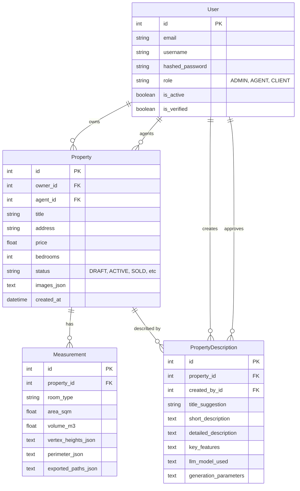

# Entity-Relationship Diagram

```mermaid
erDiagram
    User ||--o{ Property : "owns"
    User ||--o{ Property : "agents"
    User ||--o{ PropertyDescription : "creates"
    User ||--o{ PropertyDescription : "approves"

    Property ||--o{ Measurement : "has"
    Property ||--o{ PropertyDescription : "described by"

    User {
        int id PK
        string email
        string username
        string hashed_password
        string role "ADMIN, AGENT, CLIENT"
        boolean is_active
        boolean is_verified
    }

    Property {
        int id PK
        int owner_id FK
        int agent_id FK
        string title
        string address
        float price
        int bedrooms
        string status "DRAFT, ACTIVE, SOLD, etc"
        text images_json
        datetime created_at
    }

    Measurement {
        int id PK
        int property_id FK
        string room_type
        float area_sqm
        float volume_m3
        text vertex_heights_json
        text perimeter_json
        text exported_paths_json
    }

    PropertyDescription {
        int id PK
        int property_id FK
        int created_by_id FK
        string title_suggestion
        text short_description
        text detailed_description
        text key_features
        text llm_model_used
        text generation_parameters
    }
```
